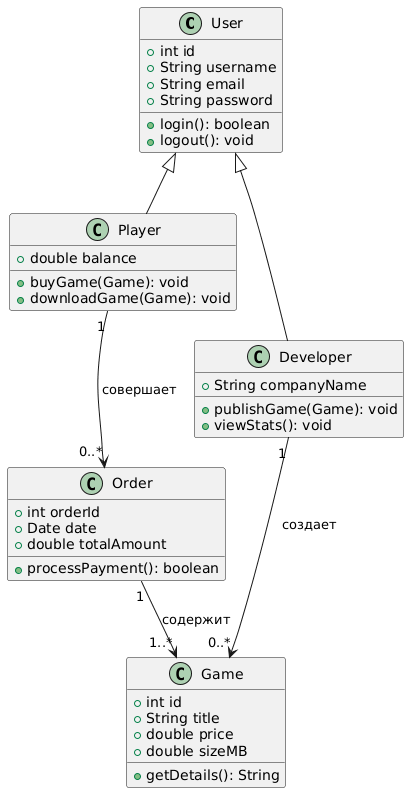
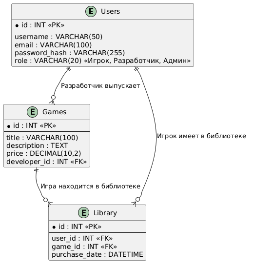
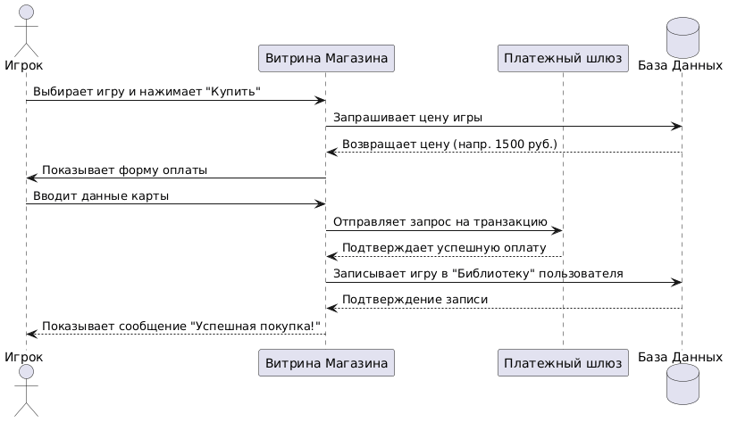
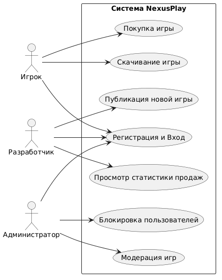
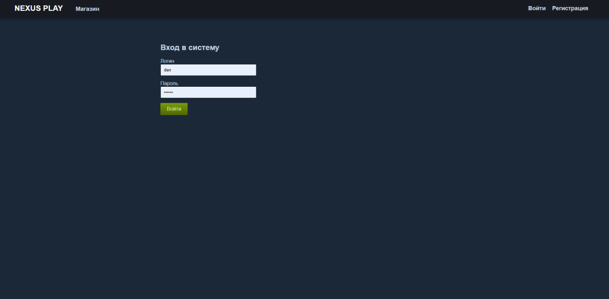
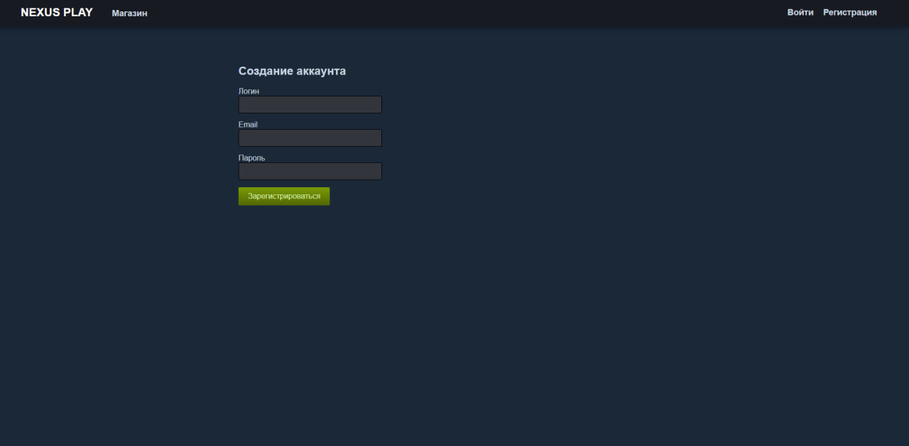
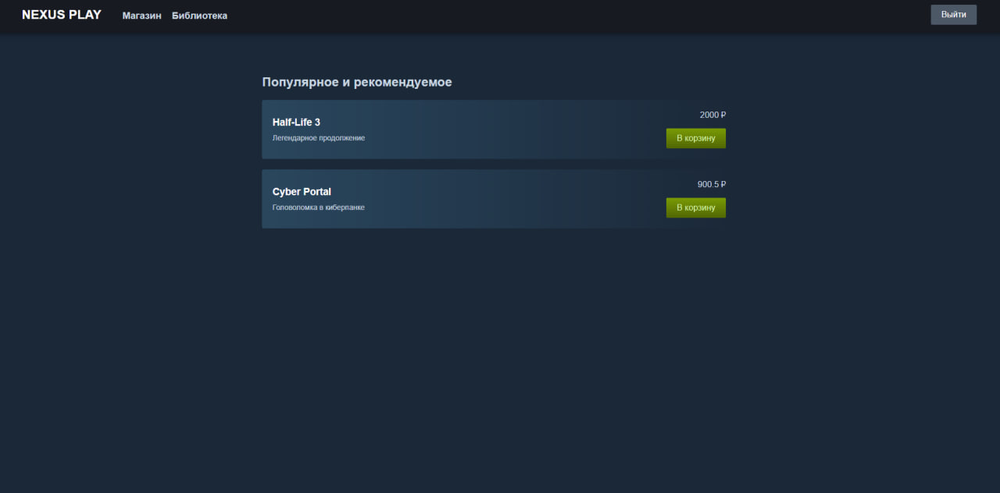
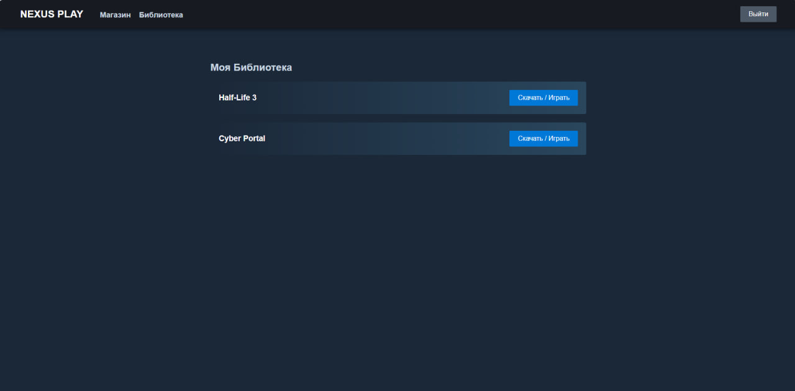

# Описание предметной области

## Часть 1. Описание организации и текущих бизнес-процессов (Без ИС)

**Наименование организации:** ООО «ГеймНексус» (GameNexus)
**Сфера деятельности:** Издательство, дистрибуция и розничная продажа компьютерных игр. 

Исторически компания занималась продажей физических копий игр (дисков) через партнерские сети, а также реализацией цифровых ключей активации через заявки по электронной почте и простые веб-витрины. Организация выступает посредником между студиями-разработчиками и конечными потребителями (игроками).

### Штатное расписание и должности:
1. **Директор:** Принимает стратегические решения, заключает ключевые контракты с крупными игровыми издательствами.
2. **Менеджер по работе с партнерами (Разработчиками):** Ищет новые инди-студии, запрашивает у них промо-материалы, получает таблицы с ключами активации игр.
3. **Менеджер по продажам (Обработчик заказов):** Принимает заявки от покупателей, проверяет факт оплаты, вручную отправляет ключи на email.
4. **Бухгалтер:** Ведет учет проданных копий, вручную рассчитывает процент отчислений (роялти), который необходимо выплатить разработчикам в конце месяца.
5. **Специалист технической поддержки:** Обрабатывает жалобы клиентов (например, если ключ не сработал или игра не запускается), связывается с разработчиками для получения патчей и рассылает обновления игрокам ссылками на файлообменники.

### Бизнес-процессы без единой информационной системы (Текущее состояние "Как есть"):
* **Процесс добавления новой игры в продажу:** Менеджер связывается с разработчиком. Разработчик присылает файлы игры на флешке или через облако, а также Excel-таблицу с 1000 сгенерированных ключей. Менеджер вручную создает страницу игры на сайте-витрине и копирует описание.
* **Процесс продажи:** Игрок переводит деньги на реквизиты компании и оставляет свой email. Менеджер по продажам видит поступление, берет один ключ из Excel-таблицы (помечает его красным цветом, как проданный) и отправляет игроку письмом вместе со ссылкой на скачивание архива с игрой.
* **Процесс обновления игры:** Разработчик выпускает патч, присылает его менеджеру. Менеджер пишет письмо всем, кто ранее купил игру, с просьбой скачать новый архив и переустановить игру.
* **Процесс расчета с авторами:** В конце месяца бухгалтер сводит все Excel-таблицы продаж, высчитывает комиссию магазина (например, 30%) и оформляет банковские переводы десяткам разработчиков.

**Проблематика:** Данный подход требует огромных затрат ручного труда, подвержен человеческому фактору (отправка уже активированного ключа, утеря таблиц), не защищает игры от пиратства и заставляет покупателей часами ждать свои заказы.

---

## Часть 2. Описание информационной системы (ИС «NexusPlay»)

**Цель внедрения ИС:** Разработка и внедрение платформы цифровой дистрибуции «NexusPlay» (аналог Steam) для полной автоматизации процессов публикации, покупки, скачивания и обновления видеоигр, а также для создания социального хаба для игроков.

### Зачем нужна ИС и для кого:
Система предназначена для объединения трех целевых групп:
1. **Игроки (Покупатели)** — получают единую библиотеку игр, моментальный доступ к покупкам и автоматические обновления.
2. **Разработчики / Издатели** — получают удобный инструмент для самостоятельной публикации игр, сбора статистики и монетизации.
3. **Сотрудники «ГеймНексус» (Администраторы)** — избавляются от рутины и переходят к модерации контента и контролю качества.

### Кто и как сможет пользоваться (Ролевая модель):

**1. Роль: Игрок (Пользователь)**
* *Как пользуется:* Регистрирует аккаунт, скачивает клиентское приложение (лаунчер) на свой ПК.
* *Доступный функционал:*
  * Просмотр каталога (магазина) игр с фильтрацией по жанрам и ценам.
  * Покупка игр через интегрированный платежный шлюз (карта, электронные кошельки).
  * Управление «Библиотекой» (скачивание, установка и удаление игр в один клик).
  * Использование социальных функций: добавление в друзья, текстовый/голосовой чат, написание отзывов на пройденные игры, получение «достижений» (ачивок).

**2. Роль: Разработчик (Партнер)**
* *Как пользуется:* Авторизуется в специальном веб-портале "NexusPlay Партнер".
* *Доступный функционал:*
  * Самостоятельное создание карточки игры (загрузка трейлеров, скриншотов, описания).
  * Прямая загрузка билдов (файлов) игры и патчей на сервера платформы.
  * Просмотр аналитики в реальном времени (сколько человек добавило игру в «Список желаемого», сколько купило, сколько оформило возврат).
  * Настройка скидок и участие в сезонных распродажах.

**3. Роль: Администратор платформы (Сотрудник)**
* *Как пользуется:* Работает через защищенную панель администратора.
* *Доступный функционал:*
  * Модерация новых игр (проверка на вирусы и запрещенный контент перед релизом).
  * Рассмотрение спорных ситуаций (тикеты техподдержки, жалобы на мошенничество).
  * Настройка глобальных событий на платформе (например, "Летняя распродажа").

### Какие задачи упрощает или полностью решает ИС:

* **Моментальная доставка товара (Решено полностью):** Игроку больше не нужно ждать письма с ключом от менеджера. После транзакции игра автоматически и мгновенно появляется в его цифровой библиотеке.
* **Автоматизация патчей и обновлений (Решено полностью):** Игрокам не нужно вручную качать архивы с обновлениями. Лаунчер ИС сам обнаруживает выход патча от разработчика и скачивает его в фоновом режиме.
* **Исключение потери купленных игр (Упрощено):** Диски могут поцарапаться, а ссылки в email — устареть. В ИС игра навсегда привязывается к аккаунту пользователя; он может скачать ее в любой момент на любом ПК.
* **Защита от пиратства (DRM) (Решено частично):** ИС предоставляет встроенную систему защиты. Игра не запустится, если пользователь не авторизован в клиенте и не имеет лицензии на своем аккаунте.
* **Автоматизация финансовых потоков (Решено полностью):** ИС автоматически расщепляет платеж: 70% уходит на виртуальный счет разработчика, 30% — комиссия платформы. Бухгалтеру больше не нужно вести ручные расчеты в Excel.
* **Оформление возвратов (Упрощено):** Процесс возврата средств за игру (если она не понравилась и наиграно менее 2-х часов) происходит по нажатию одной кнопки пользователем на основе заданных алгоритмов без участия живого оператора техподдержки.

---

## Часть 3. Диаграммы и скриншоты системы

### Диаграммы

*Диаграмма классов системы*


*ER-диаграмма базы данных*


*Диаграмма последовательности*


*Диаграмма прецедентов (Use Case)*

### Скриншоты интерфейса

*Страница авторизации*


*Страница регистрации*


*Главная страница магазина после регистрации*


*Библиотека пользователя*

---

## Часть 4. Инструкция по запуску приложения

### Требования
- Python 3.11+
- Node.js 18+
- npm

### Запуск Backend

1. Откройте терминал и перейдите в папку backend:
```bash
cd C:\Users\user\Desktop\den\backend
```

2. Активируйте виртуальное окружение:
```bash
.venv\Scripts\activate
```

3. Установите зависимости (если еще не установлены):
```bash
pip install -r requirements.txt
```

4. Запустите сервер:
```bash
uvicorn main:app --reload
```

Backend запустится на `http://localhost:8000`

### Запуск Frontend

1. Откройте **новый** терминал и перейдите в папку frontend:
```bash
cd C:\Users\user\Desktop\den\frontend
```

2. Установите зависимости (если еще не установлены):
```bash
npm install
```

3. Запустите сервер разработки:
```bash
npm run dev
```

Frontend запустится на `http://localhost:5173`

### Первый вход в систему

После запуска откройте браузер и перейдите на `http://localhost:5173`

1. Нажмите **"Регистрация"** и создайте новый аккаунт
2. Войдите под созданным пользователем
3. В магазине доступны тестовые игры: "Half-Life 3" и "Cyber Portal"
4. Нажмите **"В корзину"** для покупки игры
5. Перейдите в **"Библиотека"** для просмотра купленных игр